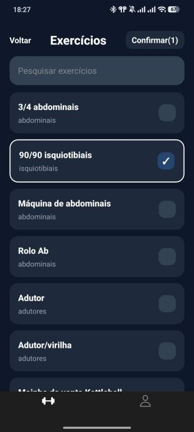
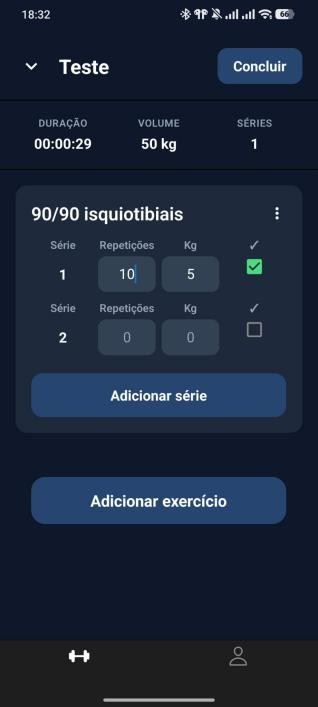
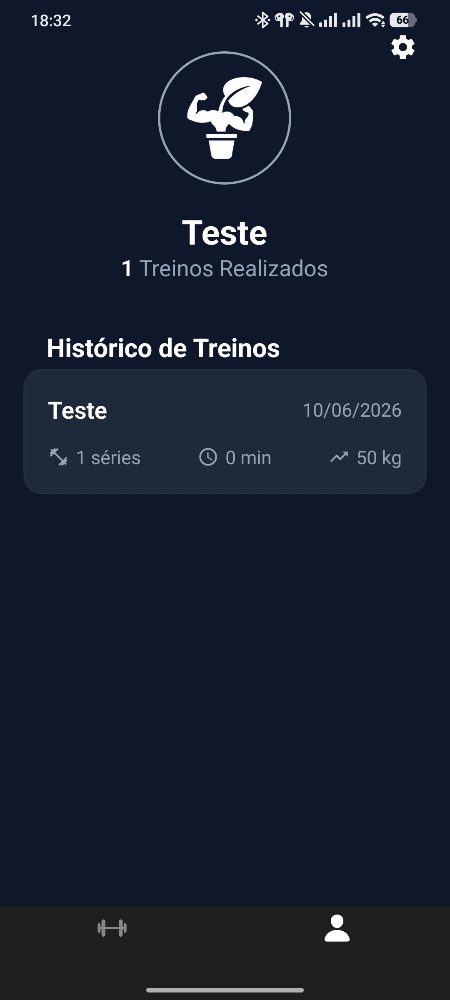

# HevyReps


Aplicação móvel para registar treinos de ginásio: rotinas personalizadas, sessão de treino em tempo real e histórico com estatísticas. Frontend em React Native/Expo, backend próprio em FastAPI, dados no Firebase Firestore.

Nasceu como Prova de Aptidão Profissional do curso de Gestão e Programação de Sistemas Informáticos.

## Índice

- [Capturas de ecrã](#capturas-de-ecrã)
- [Funcionalidades](#funcionalidades)
- [Arquitetura e stack](#arquitetura-e-stack)
- [Estrutura do repositório](#estrutura-do-repositório)
- [Como correr localmente](#como-correr-localmente)
- [Documentação da API](#documentação-da-api)
- [Decisões técnicas que valem a pena destacar](#decisões-técnicas-que-valem-a-pena-destacar)
- [Segurança](#segurança)
- [Limitações conhecidas e próximos passos](#limitações-conhecidas-e-próximos-passos)
- [Licença](#licença)

## Capturas de ecrã

<table>
  <tr>
    <td align="center"><br/>Login</td>
    <td align="center"><br/>Criar treino</td>
    <td align="center"><br/>Escolha de exercícios</td>
  </tr>
  <tr>
    <td align="center"><br/>Informação do exercício</td>
    <td align="center"><br/>Treino ativo</td>
    <td align="center"><br/>Perfil</td>
  </tr>
</table>

## Funcionalidades

- Registo e login por username ou email, com validações no cliente antes de qualquer chamada ao backend
- Autenticação por JWT: access token de curta duração (15 min) + refresh token (90 dias) com renovação automática, sem sessões guardadas no servidor
- Passwords encriptadas com Argon2
- Criação, edição e eliminação de rotinas de treino
- Biblioteca com mais de 800 exercícios (dataset [Free Exercise DB](https://github.com/yuhonas/free-exercise-db)), com nomes, músculos e instruções traduzidos automaticamente para português
- Sessão de treino em tempo real com arquitetura offline-first — os dados ficam guardados no dispositivo enquanto o treino decorre e só são enviados ao servidor no fim, mesmo que a ligação falhe a meio
- Histórico de treinos paginado, com volume total, número de séries e duração calculados automaticamente
- Perfil com estatísticas e foto de perfil (upload e recorte de imagem via Cloudinary)
- Edição de conta: alterar nome de utilizador, alterar password, eliminar conta

## Arquitetura e stack

**Frontend** — React Native com Expo (SDK 54), navegação com React Navigation (stacks + bottom tabs), estado global de autenticação e de treino via Context API, persistência local com AsyncStorage e SecureStore.

**Backend** — Python com FastAPI, organizado em três camadas:

- `routes/` — recebe os pedidos HTTP, valida o token JWT e delega o trabalho
- `services/` — lógica de negócio (criar utilizador, gerir treinos, calcular estatísticas, traduzir exercícios)
- `models/` — schemas Pydantic que validam o formato dos dados de entrada e saída

**Base de dados** — Firebase Firestore (NoSQL), com as coleções `users`, `workouts` e `workout_history`.

**Serviços externos** — Cloudinary para armazenamento de fotos de perfil; Google Translate (via `deep-translator`) para traduzir o dataset de exercícios em tempo real.

```
┌─────────────┐      HTTPS/JSON      ┌─────────────┐      ┌──────────────────┐
│  App (Expo) │ ───────────────────▶ │   FastAPI   │ ───▶ │ Firebase Firestore│
│ React Native│ ◀─────────────────── │   (Back)    │      └──────────────────┘
└─────────────┘                      └─────────────┘
       │                                    │
       ▼                                    ▼
  Cloudinary                         Google Translate
 (fotos de perfil)                (nomes de exercícios)
```

## Estrutura do repositório

```
HevyReps/
├── Front/                     # App React Native (Expo)
│   ├── App.js
│   ├── src/
│   │   ├── api/                # chamadas à API (auth, workouts, exercises, profile...)
│   │   ├── components/         # Button, Input, DropdownMenu, ExerciseCard, ImgProfile
│   │   ├── context/             # AuthContext, WorkoutContext
│   │   ├── navigation/          # stacks e bottom tabs
│   │   ├── screens/             # Login, Workouts, WorkoutEditor, WorkoutSession, Profile...
│   │   └── styles/
│   └── package.json
│
├── Back/                       # API FastAPI
│   ├── main.py                 # ponto de entrada, registo de routers
│   ├── routes/                 # auth, login, user, workouts, workout_history, exercises
│   ├── services/                # lógica de negócio
│   ├── models/                  # schemas Pydantic
│   ├── utils/                   # jwt_utils, security (hash de passwords)
│   ├── core/                     # ligação ao Firebase
│   └── requirements.txt
│
├── firestore.rules
└── firebase.json
```

## Como correr localmente

### Pré-requisitos

- Node.js 20.19 ou superior
- Python 3.11 ou superior
- Uma conta Firebase (Firestore ativado) e o respetivo ficheiro de credenciais de service account
- Uma conta Cloudinary (para o upload de fotos de perfil)
- Expo Go instalado no telemóvel, ou um emulador Android/iOS

### Backend

```bash
cd Back
python -m venv venv
source venv/bin/activate        # Windows: venv\Scripts\activate

pip install -r requirements.txt

cp .env.example .env
```

Edita o `.env` e preenche:

```
FIREBASE_CREDENTIALS_PATH=<caminho para o teu ficheiro service account>
SECRET_KEY=<uma chave secreta forte, gerada por ti>
```

Coloca o ficheiro de credenciais do Firebase no caminho indicado (nunca comites este ficheiro — já está no `.gitignore`).

```bash
uvicorn main:app --reload
```

A API fica disponível em `http://localhost:8000`.

### Frontend

```bash
cd Front
npm install
cp .env.example .env
```

Edita o `.env`:

```
EXPO_PUBLIC_BACKEND_URL=http://<o-teu-ip-local>:8000
EXPO_PUBLIC_CLOUDINARY_URL=<url de upload da tua conta Cloudinary>
```

```bash
npx expo start
```

> Se fores testar num telemóvel físico via Expo Go, usa o IP da tua rede local (não `localhost`) em `EXPO_PUBLIC_BACKEND_URL`, e adiciona esse mesmo endereço à lista `origins` do CORS em `Back/main.py`.

## Documentação da API

Com o backend a correr, a documentação interativa (Swagger UI) fica disponível em `http://localhost:8000/docs`.

Principais grupos de endpoints:

| Recurso | Endpoints | Descrição |
|---|---|---|
| `/user` | `POST /register`, `GET /stats`, `PUT /username`, `PUT /password`, `PUT /ImgProfile`, `DELETE /delete` | Conta e perfil do utilizador |
| `/login` | `POST /login` | Autenticação, devolve access e refresh token |
| `/auth` | `POST /refresh-token` | Renovação do access token |
| `/exercises` | `GET /`, `GET /{id}` | Pesquisa e detalhe de exercícios (traduzidos) |
| `/workouts` | `POST /`, `GET /`, `PUT /{id}`, `DELETE /{id}` | Rotinas de treino |
| `/workout-history` | `POST /`, `GET /`, `DELETE /{id}` | Histórico de sessões concluídas |

Todas as rotas fora do login/registo exigem um `Bearer token` válido no cabeçalho `Authorization`.

## Decisões técnicas que valem a pena destacar

**Offline-first na sessão de treino** — durante um treino ativo, cada série, repetição e peso fica guardado no AsyncStorage do dispositivo e num contexto React em memória. Só no fim é que os dados seguem para o Firestore. Isto evita perder um treino inteiro por causa de uma queda de rede a meio da sessão, que era o cenário mais frequente durante os testes.

**Cache de traduções** — a tradução dos +800 exercícios (nomes, músculos, instruções) é feita em tempo real via `deep_translator`, o que tem latência. Um `lru_cache` com capacidade para 5000 entradas evita voltar a traduzir o que já foi pedido antes, tornando os pedidos seguintes praticamente instantâneos.

**Histórico paginado por cursor** — a listagem do histórico de treinos usa paginação baseada no timestamp de criação (`created_at`, ordem descendente) em vez de offset, o que evita duplicados ou saltos quando há novos registos a serem criados enquanto o utilizador percorre a lista.

## Segurança

- `Back/.env` e `Back/credentials/` nunca foram commitados — estão no `.gitignore`. É preciso criar os teus próprios ficheiros a partir dos `.env.example`.
- O `SECRET_KEY` usado para assinar os JWT deve ser gerado por ti; não uses valores de exemplo em produção.
- As regras de acesso ao Firestore estão definidas em `firestore.rules`.

## Limitações conhecidas e próximos passos

- Não existe (ainda) gestão de dieta/nutrição — estava planeada inicialmente, mas ficou de fora por limitações de tempo
- Sem gráficos de progressão por exercício ao longo do tempo
- Sem notificações de descanso configurável entre séries
- Sem funcionalidades sociais (partilha de treinos, comparação entre utilizadores)

## Licença

Distribuído sob a licença MIT. Consulta o ficheiro [LICENSE](LICENSE) para mais detalhes.
